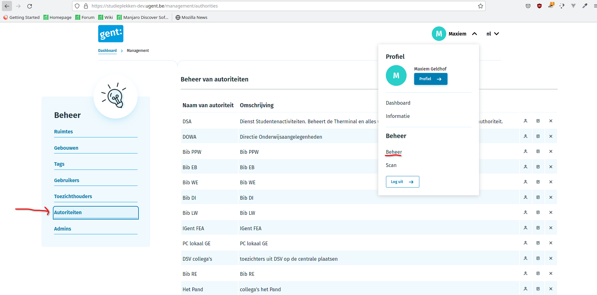
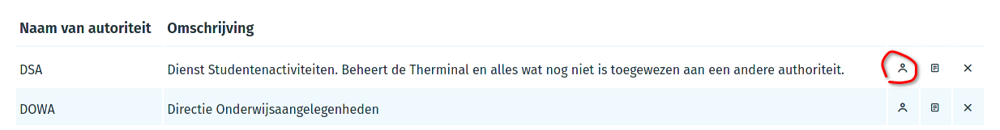

# Gebruikershandleiding - Administrator

Op deze pagina kan je extra informatie vinden voor de administrators van de verschillende hogeronderwijsinstellingen.

Als administrator ben je het eerste aanspreekpunt voor de beheerders van jouw hogeronderwijsinstelling, en draag je de eindverantwoordelijkheid voor de locaties die onder jouw beheer vallen. Om dit te kunnen doen, heb jij het hoogste niveau van mogelijke permissies op het platform. Wanneer er vragen zijn die jij niet kunt oplossen kunnen deze alsnog doorgestuurd worden naar de technische beheerders op studieplekken@student.ugent.be.

## Beheerdersgroepen of 'authorities'

Als administrator is het niet noodzakelijk de bedoeling dat je het beheer van alle locaties van je hogeronderwijsinstelling op jezelf neemt: je kan hiervoor beheerders aanstellen. Beheerders hebben toegang tot een deel van de locaties die op de site ter beschikking staan, en kunnen zelf locaties toevoegen aan hun beheerdersgroep. Kortom: dit zijn de mensen die in de praktijk de locaties zullen uitbaten.

Je kan een overzicht krijgen van deze groepen door op beheer te klikken, en op het menu aan de linkerkant te kiezen voor 'autoriteiten':

Je kan kiezen om een nieuwe autoriteit toe te voegen door op de 'Autoriteit toevoegen' knop te klikken en de naam + omschrijving in te vullen. Wanneer dit gebeurd is, kunnen we nieuwe personen toevoegen aan onze autoriteit. Hiervoor klik je op het personenicoontje naast de naam:

Op het volgende scherm krijg je de mogelijkheid om een gebruiker op te zoeken en hem toe te voegen aan de autoriteit. Wanneer dit gebeurd is krijgt die gebruiker de rechten toegekend om alle locaties die toebehoren aan een autoriteit te bewerken en tijdstippen toe te voegen.

## Administrators toevoegen

Als administrator kan je zelf ook andere mensen tot administrator maken. Het is echter **niet** de bedoeling om veel mensen administrator te maken, omwille van privacy: elke hogeronderwijsinstelling is beperkt tot 1-3 administrators. Deze functionaliteit is voornamelijk bedoeld om een overschakeling van administrators mogelijk te maken binnen één hogeronderwijsinstelling.

## Verdere vragen

Als er zich verdere vragen voordoen bij het gebruik van de applicatie kan je mailen naar de technische beheerders op studieplekken@student.ugent.be. 
